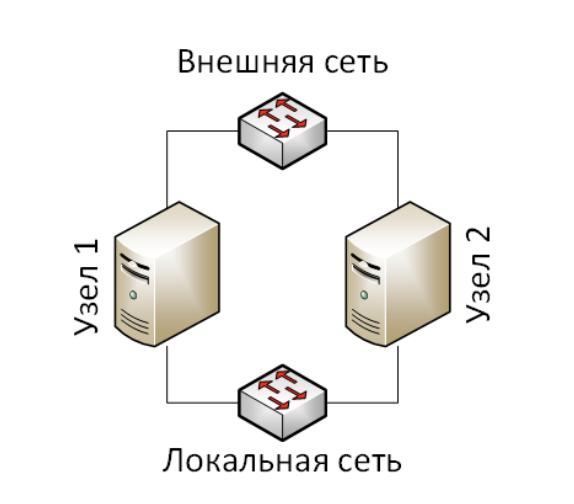

## Lab #1

### Host_1

```shell
service bind9 restart
nslookup ns1.zone1.local
nslookup ns1.zone2.local

service ssh restart
ldapmodify -D "cn=admin,dc=zone1,dc=local" -f /tmp/add_group.ldif -w 123
ldapmodify -D "cn=admin,dc=zone1,dc=local" -f /tmp/add_user.ldif -w 123
```

### Host_2
```shell
service bind9 restart
nslookup ns1.zone2.local
nslookup ns1.zone1.local

service ssh restart
ssh jsmith@192.168.0.20
```
